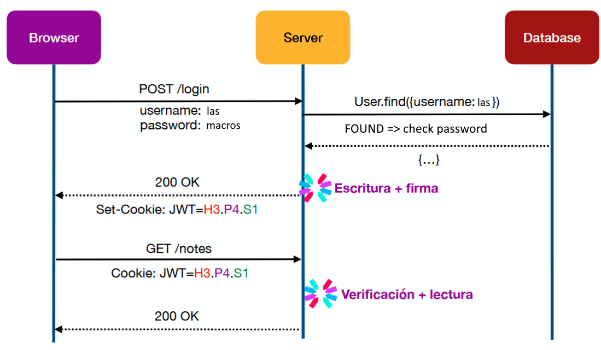

# PlayScore

Proyecto semestral para el ramo CC5003 - Aplicaciones Web Reactivas

## Ejecución del proyecto de forma local

Primero se necesita un archivo `.env` en la carpeta backend con las siguientes variables definidas:

```plain
PORT
HOST
MONGODB_URI (solo este es realmente necesario, el resto tienen valores por defecto)
JWT_SECRET
MONGODB_NAME
TEST
```

Para ver la página de forma local ejecutar los siguientes comandos:

```sh
cd ./backend

# si se está usando Windows usar alguno de los siguientes comandos
# para usar bash de Git y que los comandos para correr el servidor funcionen
npm config set script-shell "C:\\Program Files (x86)\\Git\\bin\\bash.exe"
npm config set script-shell "C:\\Program Files\\Git\\bin\\bash.exe"

npm run build:all
npm run start
```

Con los pasos anteriores listos abrir en el navegador el siguiente link `http://<HOST>:<PORT>`.

Además, para ejecutar los tests (con el servidor corriendo), desde la raíz del proyecto se debe ejecutar:

```sh
cd ./e2etests

npm run test
```

## Motivación (Tema del proyecto)

Suele ocurrir que antes de decidir si comprar un videojuego o no, la gente desea obtener la mayor referencia posible para tomar una buena decisión, pero para ello debe buscar dicha información en muchas páginas y foros.

Lo que busca nuestra propuesta de proyecto es centralizar todo esto, como por ejemplo información de los desarrolladores, valoración de los usuarios, largo promedio de duración, opiniones como tal, etc.

## Estructura del estado global

Para implementar el estado global del proyecto se utilizó la librería Zustand.

Se tiene boundStore como contenedor principal de los diferentes Slices que se definieron,
los cuales son gameSlice, userSlice, y toastSlice.

### gameSlice

Permite setear los Juegos a mostrar en la página principal, y también permite añadir un juego luego de que se añada a la base de datos.

### userSlice

Permite setear el usuario con la sesión activa dentro de la aplicación.

### toastSlice

Permite crear una notificación al usuario, con la opción de setear el mensaje, la severidad del mismo, y también permite mostrar y ocultar la notificación.

## Mapa de rutas

```
Home
|
|── Login/Register
|
|── Add Game (Solo Admin)
|
|── User Profile
|
|── GameInfo
```

## Flujo de autenticación

</img>

## Tests E2E

Para los tests se utilizó la herramienta Playwright.

### Login

Para lo relacionado con el login se tiene cubierto:
- Usuarios se pueden registrar
- Usuarios pueden ingresar
- Se notifica si las credenciales para ingresar son incorrectas
- Los usuarios invitados no pueden entrar a la vista de perfil de usuario.

### Juegos

- Los usuarios que no son administradores no pueden agregar juegos.
- Los administradores pueden agregar juegos.

## Diseño

Para el diseño y los estilos se utilizó Material-UI.

La principal decisión de diseño que se tomó fue la de utilizar tonalidades oscuras para los colores de la aplicación, esto fue así por gusto y preferencia del equipo de desarrollo. 

## URL

[fullstack.dcc.uchile.cl:7108](https://fullstack.dcc.uchile.cl:7108/)